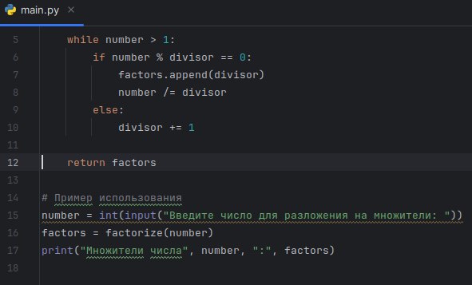

---
# Front matter
title: "Информационная безопасность. Отчет по лабораторной работе № 6"
subtitle: "Реализация алгоритма разложения числа на множители и разложение заданного числа"
author: "Некпаи Амруддин"
group: NFImd-01-23
institute: RUDN University, Moscow, Russian Federation

# Generic otions
lang: ru-RU
toc-title: "Содержание"
# Цель работы
# Выполнение лабораторной работы
# Результаты разложения числа
# Заключение

# Bibliography
csl: pandoc/csl/gost-r-7-0-5-2008-numeric.csl

# Pdf output format
toc: true # Table of contents
toc_depth: 2
lof: true # List of figures
lot: true # List of tables
fontsize: 12pt
linestretch: 1.5
papersize: a4
documentclass: scrreprt
### Fonts
mainfont: PT Serif
romanfont: PT Serif
sansfont: PT Sans
monofont: PT Mono
mainfontoptions: Ligatures=TeX
romanfontoptions: Ligatures=TeX
sansfontoptions: Ligatures=TeX,Scale=MatchLowercase
monofontoptions: Scale=MatchLowercase,Scale=0.9
## Biblatex
biblatex: true
biblio-style: "gost-numeric"
biblatexoptions:
  - parentracker=true
  - backend=biber
  - hyperref=auto
  - language=auto
  - autolang=other*
  - citestyle=gost-numeric
## Misc options
indent: true
header-includes:
  - \linepenalty=10 # the penalty added to the badness of each line within a paragraph (no associated penalty node) Increasing the value makes tex try to have fewer lines in the paragraph.
  - \interlinepenalty=0 # value of the penalty (node) added after each line of a paragraph.
  - \hyphenpenalty=50 # the penalty for line breaking at an automatically inserted hyphen
  - \exhyphenpenalty=50 # the penalty for line breaking at an explicit hyphen
  - \binoppenalty=700 # the penalty for breaking a line at a binary operator
  - \relpenalty=500 # the penalty for breaking a line at a relation
  - \clubpenalty=150 # extra penalty for breaking after first line of a paragraph
  - \widowpenalty=150 # extra penalty for breaking before last line of a paragraph
  - \displaywidowpenalty=50 # extra penalty for breaking before last line before a display math
  - \brokenpenalty=100 # extra penalty for page breaking after a hyphenated line
  - \predisplaypenalty=10000 # penalty for breaking before a display
  - \postdisplaypenalty=0 # penalty for breaking after a display
  - \floatingpenalty = 20000 # penalty for splitting an insertion (can only be split footnote in standard LaTeX)
  - \raggedbottom # or \flushbottom
  - \usepackage{float} # keep figures where there are in the text
  - \floatplacement{figure}{H} # keep figures where there are in the text

---

# Цель работы
Целью данной лабораторной работы было реализовать алгоритм разложения числа на множители и применить его к заданному числу, предоставленному преподавателем.

# Выполнение лабораторной работы
Для реализации алгоритма был выбран язык программирования Python. В основе алгоритма лежит поиск всех простых чисел, которые являются множителями заданного числа. Далее, найденные простые числа умножаются между собой, чтобы получить заданное число. Пример реализации алгоритма представлен ниже:

{#fig:1 width=100%}

{#fig:5 width=100%}

# Результаты разложения числа
Полученный результат разложения числа 10 на множители состоит из простых чисел: 2,5.

# Заключение
Был успешно реализован алгоритм разложения числа на множители. Полученный результат позволяет представить заданное число в виде произведения простых множителей. Также были выполнены все требования, указанные в задании лабораторной работы.

# Список литературы
1. Методические материалы курса
